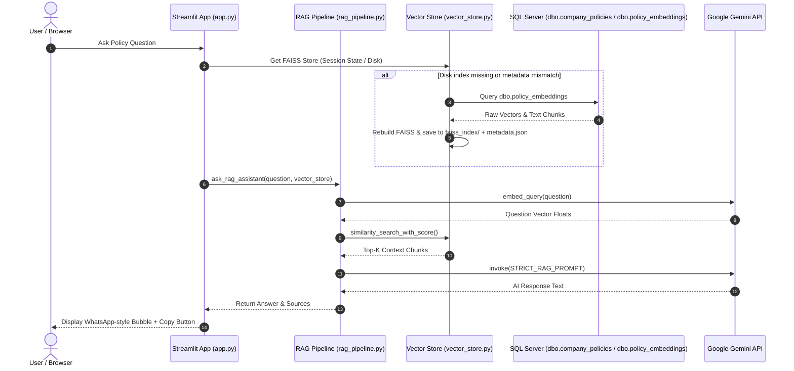

# 🏢 Corporate Policy Assistant (RAG & SQL Server Integration)

An enterprise-grade, thread-safe Retrieval-Augmented Generation (RAG) assistant built with **Streamlit**, **LangChain**, **Google Gemini**, **FAISS**, and **Microsoft SQL Server**.

---

## 🌟 Key Architecture & Highlights

- **Single Source of Truth**: Microsoft SQL Server (`dbo.company_policies` & `dbo.policy_embeddings`) is the single source of truth for all policy content, metadata, and raw vector float arrays.
- **Derived FAISS Disk Persistence**: The FAISS vector index is persisted to disk (`faiss_index/`) for fast startup. If missing, corrupted, or if configuration settings change, the index automatically rebuilds from SQL Server.
- **Metadata Configuration Validation**: A `metadata.json` file tracks `embedding_model`, `chunk_size`, `chunk_overlap`, `document_count`, and creation timestamp. Automatic index rebuilding occurs if settings differ.
- **Thread-Safe & Multi-User Ready**: Client instances (`GoogleGenerativeAIEmbeddings`, `ChatGoogleGenerativeAI`) are instantiated per request/session. Zero shared global model/vectorstore objects exist across worker threads, preventing connection locks or hanging requests.
- **Configurable Retrieval**: Configurable `TOP_K_RESULTS`, `SIMILARITY_SCORE_THRESHOLD`, `CHUNK_SIZE`, and `CHUNK_OVERLAP` via `config.py` or `.env`.
- **Resilient Retry Logic**: Single model strategy (`GEMINI_MODEL_NAME`) with exponential backoff retries handling HTTP 429 rate limits and network glitches.
- **Deletion Detection & Error Isolation**: "Refresh Knowledge Base" syncs new policies, removes orphan vector records for deleted SQL policies, isolates item-level sync failures without aborting, and refreshes the cached index.
- **Structured Performance Logging**: Execution metrics logged for SQL queries, embedding calls, FAISS disk loads, similarity searches, and total end-to-end question response times.

---

## 🔄 System Process Flow



---

## 📁 Repository Structure

```text
├── .env.example            # Environment configuration template
├── .gitignore              # Excludes .venv, .env, faiss_index/ (rebuilt automatically from SQL)
├── README.md               # Project documentation
├── app.py                  # Streamlit web interface & UI components
├── config.py               # Central settings, environment variables, & ODBC connection string
├── database.py             # SQL Server database query & persistence layer
├── db_setup.py             # Database creation, table schema setup, & seed data initialization
├── logger.py               # Structured logging configuration
├── rag_pipeline.py         # RAG prompt construction & Gemini LLM invocation engine
├── requirements.txt        # Python package dependencies
├── vector_store.py         # FAISS vector store loading, disk persistence, metadata tracking, & sync engine
└── Resource/               # Backup Excel spreadsheets and assets
```

---

## ⚙️ Configuration Settings (`config.py` / `.env`)

| Variable | Default Value | Description |
| :--- | :--- | :--- |
| `GEMINI_API_KEY` | `""` | Google Gemini API Key from Google AI Studio |
| `GEMINI_MODEL_NAME` | `gemini-2.0-flash` | Configured Gemini chat model name |
| `EMBEDDING_MODEL_NAME` | `models/gemini-embedding-001` | Configured Gemini embedding model name |
| `TOP_K_RESULTS` | `3` | Number of context chunks retrieved per query |
| `SIMILARITY_SCORE_THRESHOLD` | `0.0` | Minimum score threshold for retrieved chunks |
| `CHUNK_SIZE` | `400` | Text chunk size for document splitting |
| `CHUNK_OVERLAP` | `50` | Text chunk overlap size |
| `MAX_RETRIES` | `3` | Maximum retry attempts for API calls |
| `BACKOFF_FACTOR` | `2.0` | Exponential backoff multiplier for retries |
| `DB_SERVER` | `localhost` | Microsoft SQL Server hostname or IP |
| `DB_NAME` | `KB_RAG` | Target database name |
| `DB_DRIVER` | `ODBC Driver 17 for SQL Server` | PyODBC Driver string |
| `DB_TRUSTED_CONNECTION` | `yes` | `yes` for Windows Auth, `no` for SQL Auth |

---

## 🚀 Step-by-Step Setup & Installation

### 1. Prerequisites
- **Python 3.10+**
- **Microsoft SQL Server** (Local or Remote) with **ODBC Driver 17 for SQL Server** installed.
- **Google Gemini API Key** from [Google AI Studio](https://aistudio.google.com/).

### 2. Create Virtual Environment
```bash
python -m venv .venv
# Activate on Windows PowerShell:
.\.venv\Scripts\Activate.ps1
# Activate on Linux/macOS:
source .venv/bin/activate
```

### 3. Install Dependencies
```bash
pip install -r requirements.txt
```

### 4. Setup Environment Credentials
Copy `.env.example` to `.env` and set your API key:
```ini
GEMINI_API_KEY=your_actual_gemini_api_key_here
DB_SERVER=localhost
DB_NAME=KB_RAG
DB_DRIVER=ODBC Driver 17 for SQL Server
DB_TRUSTED_CONNECTION=yes
```

### 5. Initialize SQL Server Database
Run the setup script to create the database, tables, and seed initial corporate policy records:
```bash
python db_setup.py
```

### 6. Synchronize Knowledge Base
Generate initial vector embeddings and store them directly in SQL Server:
```bash
python -c "import vector_store; vector_store.sync_vector_store()"
```

### 7. Run Streamlit Web Application
```bash
streamlit run app.py
```
Open your browser at `http://localhost:8501`.

---

## 🛡️ Concurrency & Deployment Design

1. **Thread-Safe Architecture**:
   - `vector_store.py` and `rag_pipeline.py` do not store global model or vector store instances in module memory.
   - Embeddings and LLM models are instantiated per request/session, ensuring zero gRPC channel locks across concurrent Streamlit threads.
2. **Session State Isolation**:
   - Each browser session holds its FAISS vectorstore instance in `st.session_state["vector_store"]`.
   - When "Refresh Knowledge Base" is clicked, new embeddings are saved to SQL Server, the disk index snapshot is refreshed, and session states update cleanly.
3. **Deployment**:
   - Safe for deployment behind Gunicorn, Streamlit Community Cloud, or Docker containers with multi-worker configurations.

---

## 📝 Performance Metrics Logging

The application logs precise timing metrics for every operation:
- `[PERF] SQL get_all_stored_embeddings fetched N vector rows in X.XXXs`
- `[PERF] FAISS vector store loaded successfully from disk in X.XXXs`
- `[PERF] FAISS similarity search returned N matching chunks in X.XXXs`
- `[PERF] Gemini LLM generation completed in X.XXXs`
- `[PERF] RAG total question response time: X.XXXs`

---

## ❓ Troubleshooting

- **Error: `ODBC Driver 17 for SQL Server not found`**: Install Microsoft ODBC Driver 17 for SQL Server from Microsoft Download Center.
- **Error: `GEMINI_API_KEY is missing`**: Verify `.env` file exists in the root directory and contains `GEMINI_API_KEY=your_key`.
- **Streamlit Warning: `missing ScriptRunContext`**: This warning only appears when running scripts directly via command line; it does not affect `streamlit run app.py`.
